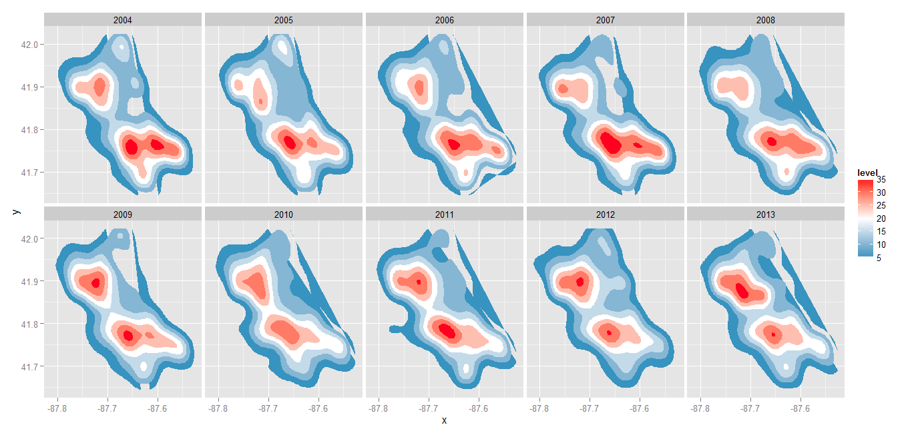
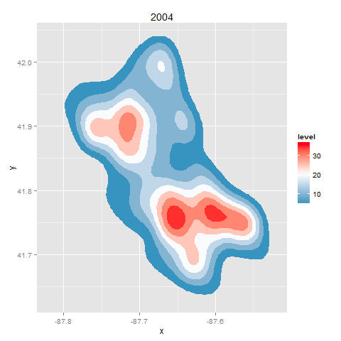

Chicago-crimes-against-kids
===========================

<html>
<body>

Crimes against children as reported to the CPD, analyzed using R and the ggplot2 and animation packages.
Produces ten separate graphs and combines them, once paneled in a 5-by-2 grid and once using sequential animation.

</body>
</html>
